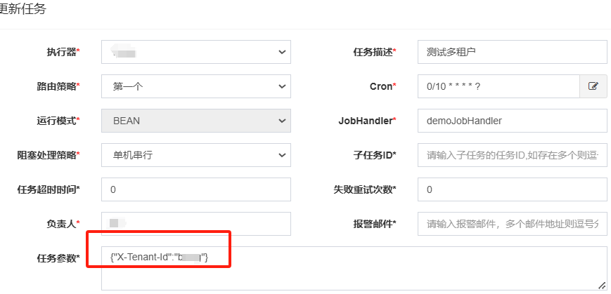
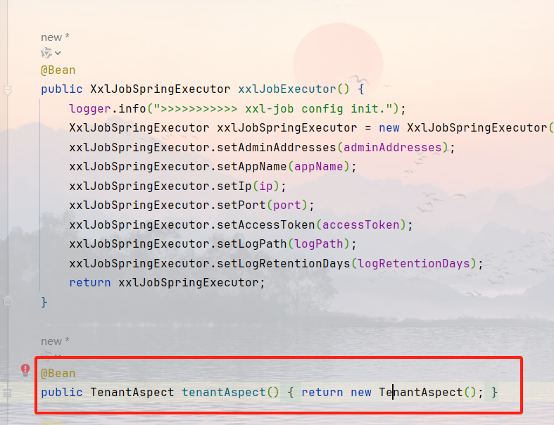

### XXL-JOB SaaS 化方案


### 单机模式

- **部分 SaaS 化**

  - **独立性维护**：XXL-JOB 作为一个独立运行的平台，保留其原始数据库结构与登录机制。
  - **任务触发机制**：
    - 在任务执行时传递租户 ID。考虑到项目使用 JDK 17 而原 sed 使用的版本是 JDK 8，存在序列化问题。因此，将 sed 组件所依赖的 job 版本升级至与项目匹配的 JDK 17，以解决兼容性问题，并已验证实现。
    - 对于需要被多个租户执行的相同任务，支持通过配置使同一个任务能够为不同租户多次创建，或配置一个任务同时服务于多个租户，遍历租户信息循环执行。管理员有权创建需所有租户执行的任务。

- **全面 SaaS 化**
  - **前后端分离**：所有请求均需通过 SaaS 平台提供的 token 进行身份验证。
  - **用户管理整合**：移除原有的用户表，将其集成至 SaaS 平台的统一用户管理系统中（包括用户、token、角色和菜单系统），使 XXL-JOB 无缝融入平台。
  - **数据隔离**：为每个租户创建独立的数据表，确保在逻辑层面上的数据隔离，保证各租户只能访问自己的任务信息。
  - **任务新建与触发机制**：
    - 租户仅能创建属于自己的任务；管理员则可创建适用于所有租户的任务。
    - 修改 JobScheduleHelper 加载任务信息的方式，使其从多数据源获取，并调整调度中心的分布式锁实现方式，以适应多租户环境。同时，在任务执行时根据数据源传递租户 ID。评估快慢线程池、调度线程、时间轮线程等是否需要支持多租户。

### 集群模式

- **独立部署**
  - 每个租户拥有独立的调度中心和数据源。鉴于 XXL-JOB 本身支持多调度中心，可根据数据源名称触发任务并传递租户 ID。
  - 需解决的问题是如何限制租户只能看到自己的调度中心。
  - 注释掉注册循环中的 break 语句，以便原先针对单一数据源的调度中心能适应新的需求。

### 采用方案

最后采用任务传参方式：

- **建立任务时传参**
  
- **新建 aop**
  在任务调用前后对租户进行处理
  
  

```
package com.xxl.job.core.context;

import com.alibaba.fastjson2.JSONArray;
import com.alibaba.fastjson2.JSONObject;
import com.bewg.saas.infra.common.Constants;
import com.bewg.saas.infra.common.TenantContext;
import com.bewg.saas.infra.common.TenantProfile;
import com.bewg.saas.infra.rdbms.TenantAwareDynamicRoutingDataSource;
import com.xxl.job.core.biz.model.ReturnT;
import com.xxl.job.core.handler.annotation.XxlJob;
import com.xxl.job.core.log.XxlJobFileAppender;
import com.xxl.job.core.log.XxlJobLogger;
import jakarta.annotation.Resource;
import lombok.extern.slf4j.Slf4j;
import org.apache.commons.lang3.StringUtils;
import org.aspectj.lang.ProceedingJoinPoint;
import org.aspectj.lang.annotation.Around;
import org.aspectj.lang.annotation.Aspect;
import org.springframework.scheduling.concurrent.CustomizableThreadFactory;
import org.springframework.stereotype.Component;

import java.io.PrintWriter;
import java.io.StringWriter;
import java.util.ArrayList;
import java.util.List;
import java.util.concurrent.*;
import java.util.concurrent.atomic.AtomicBoolean;

/**
 * 租户xxlJob切面
 *
 * @author hc
 * @date 2025/03/10
 */
@Aspect
@Component
@Slf4j
public class TenantAspect {


    public static final ThreadFactory CUSTOM_POOL = new CustomizableThreadFactory("tenant-job-");
    private final ThreadPoolExecutor tenantJobExecutor = new ThreadPoolExecutor(20, 50, 10L, TimeUnit.SECONDS,
            new ArrayBlockingQueue<>(50), CUSTOM_POOL, (r, executor) -> {
        log.debug("队列满了，而且线程数量达到了最大数量");
        try {
            executor.getQueue().put(r);
        } catch (InterruptedException e) {
            Thread.currentThread().interrupt();
        }
    });
    @Resource
    private TenantAwareDynamicRoutingDataSource tenantAwareDynamicRoutingDataSource;

    /**
     * 环绕执行
     *
     * @param joinPoint 加入点
     * @param xxlJob    xxl 注解
     * @return {@link Object }
     * @throws Throwable 异常
     */
    @Around("@annotation(xxlJob)")
    public Object aroundExecute(ProceedingJoinPoint joinPoint, XxlJob xxlJob) throws Throwable {
        // 在这里获取job参数并设置租户上下文
        String jobParam = XxlJobHelper.getJobParam();
        Object[] args = joinPoint.getArgs();
        log.debug("Initializing tenant context for job: {}, params: {}", xxlJob.value(), jobParam);
        List<String> tenantIds = getExecutorTenants(jobParam, args);
        if (!tenantIds.isEmpty()) {
            ConcurrentHashMap<String, ReturnT<?>> tenantResultMap = new ConcurrentHashMap<>(tenantIds.size());
            CompletableFuture[] completableFutures = new CompletableFuture[tenantIds.size()];
            String logFileName = XxlJobFileAppender.contextHolder.get();
            for (int i = 0; i < tenantIds.size(); i++) {
                String tenantId = tenantIds.get(i);
                completableFutures[i] = CompletableFuture.runAsync(() -> {
                    XxlJobFileAppender.contextHolder.set(logFileName);
                    executeForTenants(joinPoint, tenantId, args, tenantResultMap);
                }, tenantJobExecutor);
            }
            CompletableFuture.allOf(completableFutures).join();
            return handleErrTenantId(tenantResultMap);
        }
        try {
            return joinPoint.proceed(args);
        } finally {
            // 清理租户上下文
            log.debug("Clear tenant context: {}", TenantContext.getCurrentTenant().getTenantId());
            TenantContext.setCurrentTenant(null);
        }
    }

    /**
     * 处理错误租户
     *
     * @param tenantResultMap 租户结果map
     */
    private static ReturnT<?> handleErrTenantId(ConcurrentHashMap<String, ReturnT<?>> tenantResultMap) {
        ReturnT<?> result = ReturnT.SUCCESS;
        //有一个租户任务失败 当前任务就标记失败
        if (tenantResultMap.containsValue(ReturnT.FAIL)) {
            //获取错误的租户id 以逗号隔开
            AtomicBoolean firstError = new AtomicBoolean(true);
            StringBuilder errorMsgBuilder = new StringBuilder();
            tenantResultMap.forEach((tenantId, returnT) -> {
                if (returnT.getCode() == ReturnT.FAIL_CODE) {
                    if (!firstError.get()) {
                        errorMsgBuilder.append(",");
                    } else {
                        firstError.set(false);
                    }
                    errorMsgBuilder.append(tenantId);
                }
            });
            XxlJobContext.getXxlJobContext().setErrTenantIds(errorMsgBuilder.toString());
            result = ReturnT.FAIL;
        }
        return result;
    }

    /**
     * 获取执行程序租户
     *
     * @param jobParam job 参数
     * @param args     参数
     * @return {@link List }<{@link String }>
     */
    private List<String> getExecutorTenants(String jobParam, Object[] args) {
        List<String> tenantIds;
        if (StringUtils.isBlank(jobParam)) {
            //1参数为空
            return getAllTenantIds();
        }
        try {
            JSONObject jsonObject = JSONObject.parseObject(jobParam);
            if (null != jsonObject && jsonObject.containsKey(Constants.DEFAULT_TENANT_ID_HEADER_NAME)) {
                // 2参数是json 且有租户字段 解析租户ID列表
                // 处理参数逻辑：当仅包含租户参数时清空参数 因为旧的任务里根据是否有业务参数进不同逻辑  现在有租户参数无业务参数 也会进业务参数逻辑
                if (jsonObject.size() == 1 && args.length > 0) {
                    args[0] = null;
                }
                return parseTenantIds(jsonObject);
            } else {
                //3参数是json 但是无租户字段
                tenantIds = getAllTenantIds();
            }
        } catch (Exception e) {
            //4参数不是json
            tenantIds = getAllTenantIds();
        }

        return tenantIds;
    }

    /**
     * 获取所有租户 ID
     *
     * @return {@link List }<{@link String }>
     */
    private List<String> getAllTenantIds() {
        List<String> tenantIds = tenantAwareDynamicRoutingDataSource.getDataSources().keySet().stream().toList();
        XxlJobLogger.log("<span style='color:green'>----------- 将执行所有租户任务" + tenantIds + " -----------</span>");
        return tenantIds;
    }


    /**
     * 租户执行
     *
     * @param joinPoint       切入点
     * @param tenantId        租户 ID
     * @param args            任务参数
     * @param tenantResultMap 所有租户结果map
     */
    private static void executeForTenants(ProceedingJoinPoint joinPoint, String tenantId, Object[] args, ConcurrentHashMap<String, ReturnT<?>> tenantResultMap) {
        ReturnT<?> proceedResult = ReturnT.SUCCESS;
        String errorMsg = "";
        try {
            // 设置当前租户上下文
            XxlJobLogger.log("----------- 设置租户上下文: {} -----------", tenantId);
            TenantContext.setCurrentTenant(new TenantProfile(tenantId));
            // 执行任务方法
            proceedResult = (ReturnT<?>) joinPoint.proceed(args);
            tenantResultMap.put(tenantId, proceedResult);
        } catch (Throwable e) {
            tenantResultMap.put(tenantId, ReturnT.FAIL);
            proceedResult = ReturnT.FAIL;

            StringWriter stringWriter = new StringWriter();
            e.printStackTrace(new PrintWriter(stringWriter));
            errorMsg = stringWriter.toString();
        } finally {
            // 清理租户上下文
            TenantContext.setCurrentTenant(null);
            if (proceedResult.equals(ReturnT.SUCCESS)) {
                XxlJobLogger.log("<span style='color:green'>----------- 清理租户上下文:{},该租户执行成功:{} -----------</span>", tenantId, proceedResult);
            } else if (proceedResult.equals(ReturnT.FAIL)) {
                XxlJobLogger.log("<span style='color:red'>----------- 清理租户上下文:" + tenantId + ",该租户执行失败:" + errorMsg + " -----------</span>");
            }
        }
    }


    /**
     * 解析租户ID列表，支持JSON数组或逗号分隔字符串
     *
     * @param jsonObject JSON 对象
     * @return {@link List }<{@link String }>
     */
    private List<String> parseTenantIds(JSONObject jsonObject) {
        List<String> tenantIds = new ArrayList<>();
        Object tenantIdValue = jsonObject.get(Constants.DEFAULT_TENANT_ID_HEADER_NAME);
        if (tenantIdValue instanceof String) {
            // 处理逗号分隔字符串
            String[] parts = ((String) tenantIdValue).split(",");
            for (String part : parts) {
                if (StringUtils.isNotBlank(part)) {
                    tenantIds.add(part.trim());
                }
            }
        } else if (tenantIdValue instanceof JSONArray array) {
            // 处理JSON数组格式
            for (int i = 0; i < array.size(); i++) {
                tenantIds.add(array.getString(i));
            }
        }
        if (tenantIds.isEmpty()) {
            tenantIds = getAllTenantIds();
        } else {
            XxlJobLogger.log("<span style='color:green'>----------- 将执行租户任务" + tenantIds + " -----------</span>");
        }
        return tenantIds;
    }
}
```
