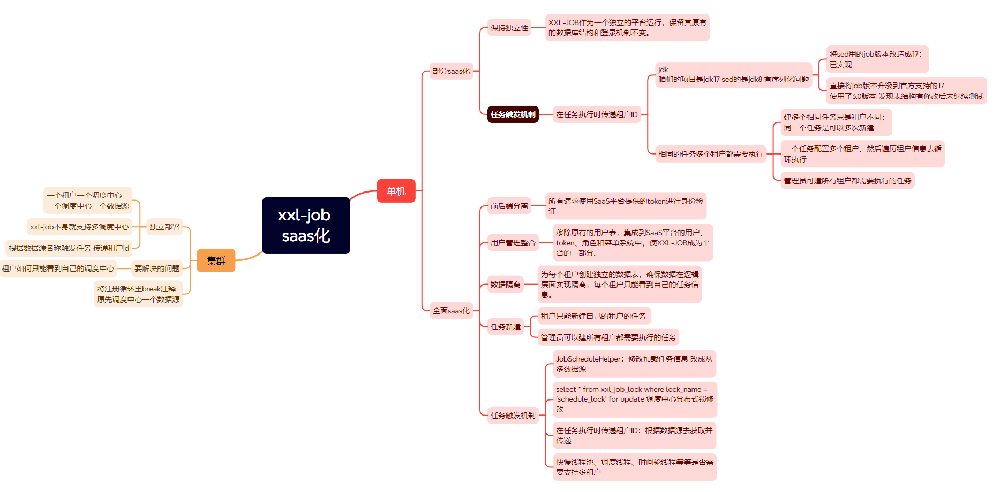
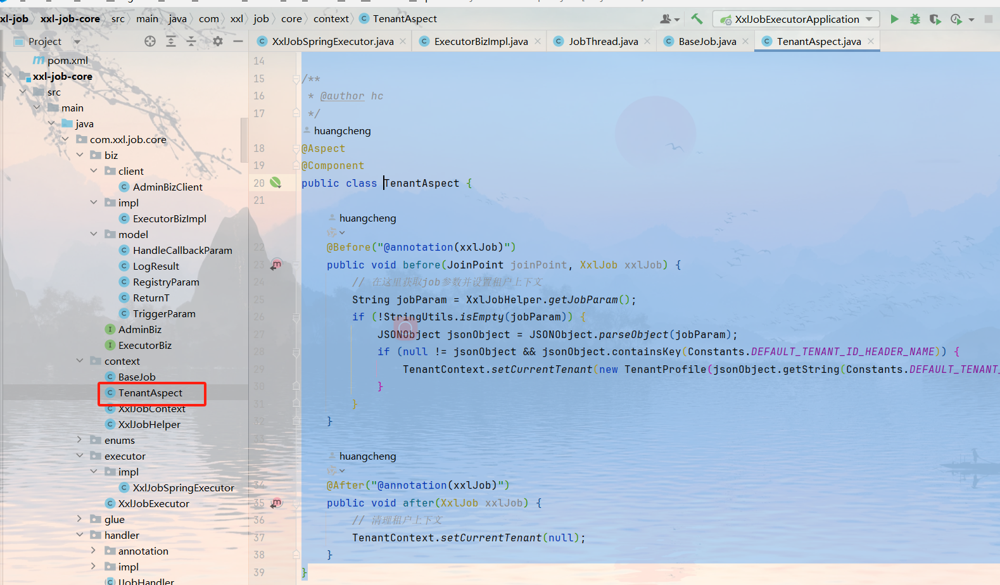
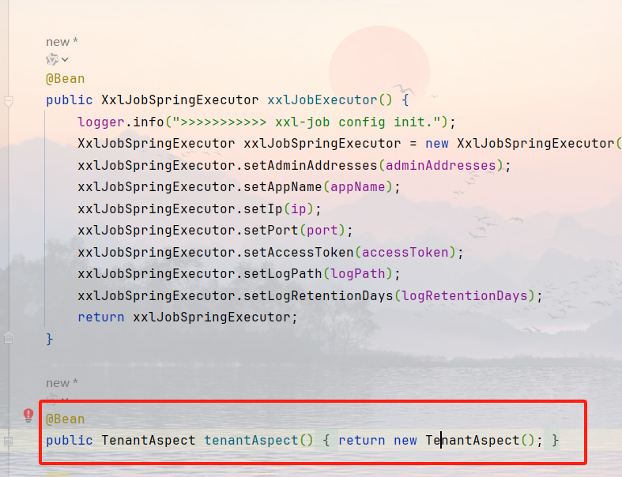

### XXL-JOB SaaS 化方案



### 单机模式

- **部分 SaaS 化**

  - **独立性维护**：XXL-JOB 作为一个独立运行的平台，保留其原始数据库结构与登录机制。
  - **任务触发机制**：
    - 在任务执行时传递租户 ID。考虑到项目使用 JDK 17 而原 sed 使用的版本是 JDK 8，存在序列化问题。因此，将 sed 组件所依赖的 job 版本升级至与项目匹配的 JDK 17，以解决兼容性问题，并已验证实现。
    - 对于需要被多个租户执行的相同任务，支持通过配置使同一个任务能够为不同租户多次创建，或配置一个任务同时服务于多个租户，遍历租户信息循环执行。管理员有权创建需所有租户执行的任务。

- **全面 SaaS 化**
  - **前后端分离**：所有请求均需通过 SaaS 平台提供的 token 进行身份验证。
  - **用户管理整合**：移除原有的用户表，将其集成至 SaaS 平台的统一用户管理系统中（包括用户、token、角色和菜单系统），使 XXL-JOB 无缝融入平台。
  - **数据隔离**：为每个租户创建独立的数据表，确保在逻辑层面上的数据隔离，保证各租户只能访问自己的任务信息。
  - **任务新建与触发机制**：
    - 租户仅能创建属于自己的任务；管理员则可创建适用于所有租户的任务。
    - 修改 JobScheduleHelper 加载任务信息的方式，使其从多数据源获取，并调整调度中心的分布式锁实现方式，以适应多租户环境。同时，在任务执行时根据数据源传递租户 ID。评估快慢线程池、调度线程、时间轮线程等是否需要支持多租户。

### 集群模式

- **独立部署**
  - 每个租户拥有独立的调度中心和数据源。鉴于 XXL-JOB 本身支持多调度中心，可根据数据源名称触发任务并传递租户 ID。
  - 需解决的问题是如何限制租户只能看到自己的调度中心。
  - 注释掉注册循环中的 break 语句，以便原先针对单一数据源的调度中心能适应新的需求。

### 采用方案

最后采用最简单的单价、任务传参方式：

- **建立任务时传参**
  
- **新建 aop**
  在任务调用前后对租户进行处理
  
  

```
package com.xxl.job.core.context;

import com.alibaba.fastjson2.JSONArray;
import com.alibaba.fastjson2.JSONObject;
import com.xxl.job.core.handler.annotation.XxlJob;
import lombok.extern.slf4j.Slf4j;
import org.apache.commons.lang3.StringUtils;
import org.aspectj.lang.ProceedingJoinPoint;
import org.aspectj.lang.annotation.Around;
import org.aspectj.lang.annotation.Aspect;
import org.springframework.stereotype.Component;

import java.util.ArrayList;
import java.util.List;
import java.util.concurrent.atomic.AtomicReference;

/**
 * @author hc
 */
@Aspect
@Component
@Slf4j
public class TenantAspect {

    @Around("@annotation(xxlJob)")
    public Object before(ProceedingJoinPoint joinPoint, XxlJob xxlJob) throws Throwable {
        // 在这里获取job参数并设置租户上下文
        String jobParam = XxlJobHelper.getJobParam();
        Object[] args = joinPoint.getArgs();
        log.debug("Initializing tenant context for job: {}, params: {}", xxlJob.value(), jobParam);
        if (StringUtils.isNotBlank(jobParam)) {
            JSONObject jsonObject = JSONObject.parseObject(jobParam);
            if (null != jsonObject && jsonObject.containsKey(Constants.DEFAULT_TENANT_ID_HEADER_NAME)) {
                // 解析租户ID列表
                List<String> tenantIds = parseTenantIds(jsonObject);
                // 处理参数逻辑：当仅包含租户参数时清空参数
                if (jsonObject.size() == 1 && args.length > 0) {
                    args[0] = null;
                }
                if (!tenantIds.isEmpty()) {
                    AtomicReference<Object> result = new AtomicReference<>();
                    tenantIds.parallelStream().forEach(tenantId -> {
                        try {
                            // 设置当前租户上下文
                            TenantContext.setCurrentTenant(new TenantProfile(tenantId));
                            log.debug("Set tenant context: {}", tenantId);
                            // 执行任务方法
                            result.set(joinPoint.proceed(args));
                        } catch (Throwable e) {
                            throw new RuntimeException(e);
                        } finally {
                            // 清理租户上下文
                            TenantContext.setCurrentTenant(null);
                            log.debug("Cleared tenant context: {}", tenantId);
                        }
                    });
                    //TODO 待确定多个租户不同的返回结果怎么解决
                    return result;
                }
            }
        }
        try {
            return joinPoint.proceed(args);
        } finally {
            // 清理租户上下文
            log.debug("Clear tenant context: {}", TenantContext.getCurrentTenant().getTenantId());
            TenantContext.setCurrentTenant(null);
        }
    }


    /**
     * 解析租户ID列表，支持JSON数组或逗号分隔字符串
     */
    private List<String> parseTenantIds(JSONObject jsonObject) {
        List<String> tenantIds = new ArrayList<>();
        Object tenantIdValue = jsonObject.get(Constants.DEFAULT_TENANT_ID_HEADER_NAME);
        if (tenantIdValue instanceof String) {
            // 处理逗号分隔字符串
            String[] parts = ((String) tenantIdValue).split(",");
            for (String part : parts) {
                if (StringUtils.isNotBlank(part)) {
                    tenantIds.add(part.trim());
                }
            }
        } else if (tenantIdValue instanceof JSONArray array) {
            // 处理JSON数组格式
            for (int i = 0; i < array.size(); i++) {
                tenantIds.add(array.getString(i));
            }
        } else if (tenantIdValue != null) {
            // 处理其他类型（如单个值）
            tenantIds.add(tenantIdValue.toString().trim());
        }
        return tenantIds;
    }


}
```
