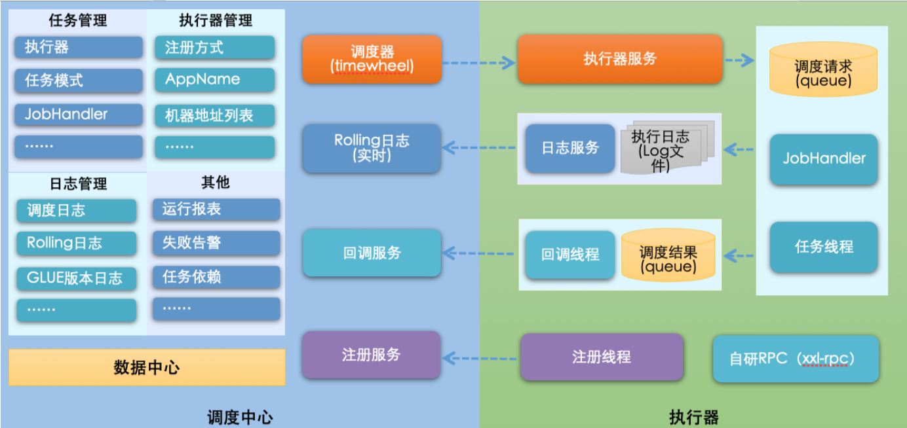
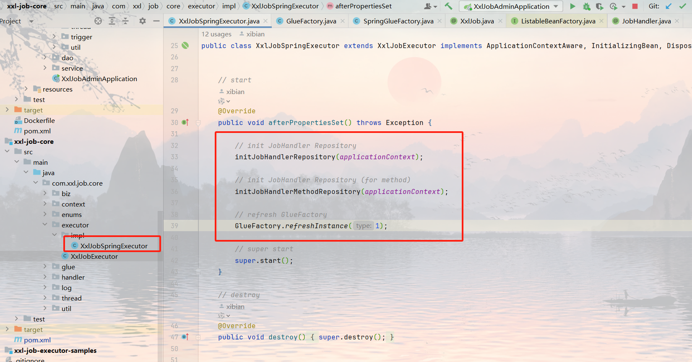
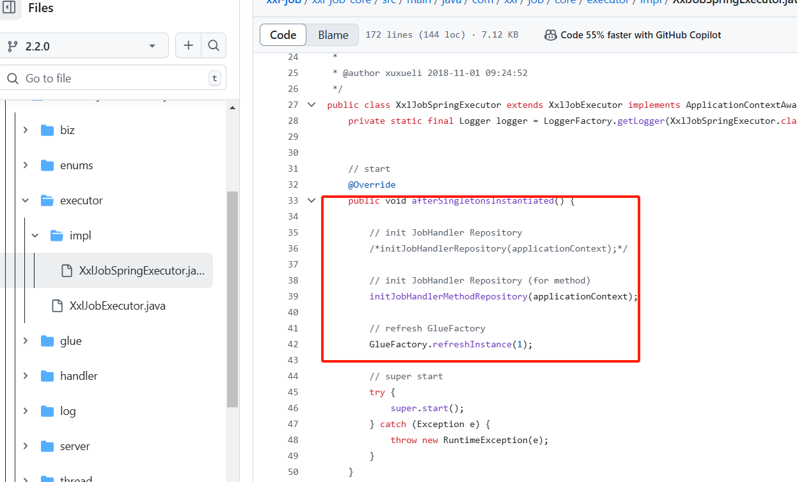
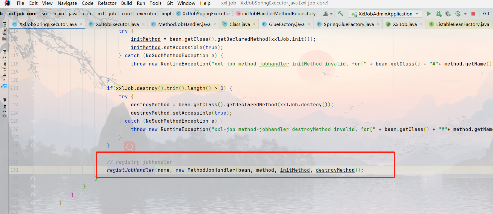
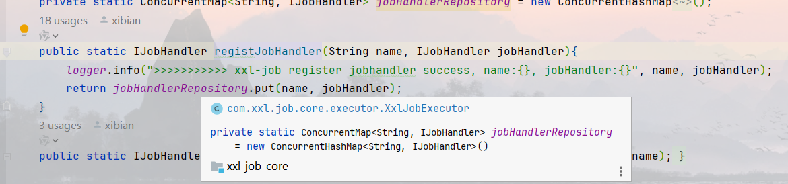
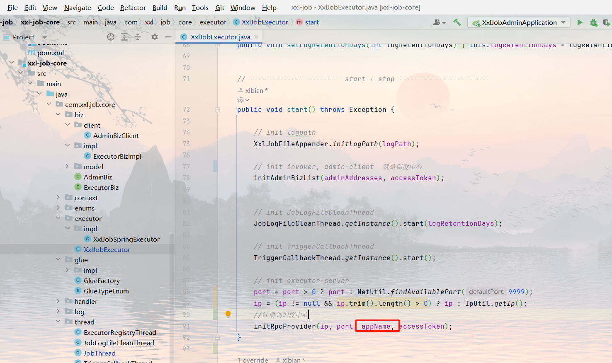
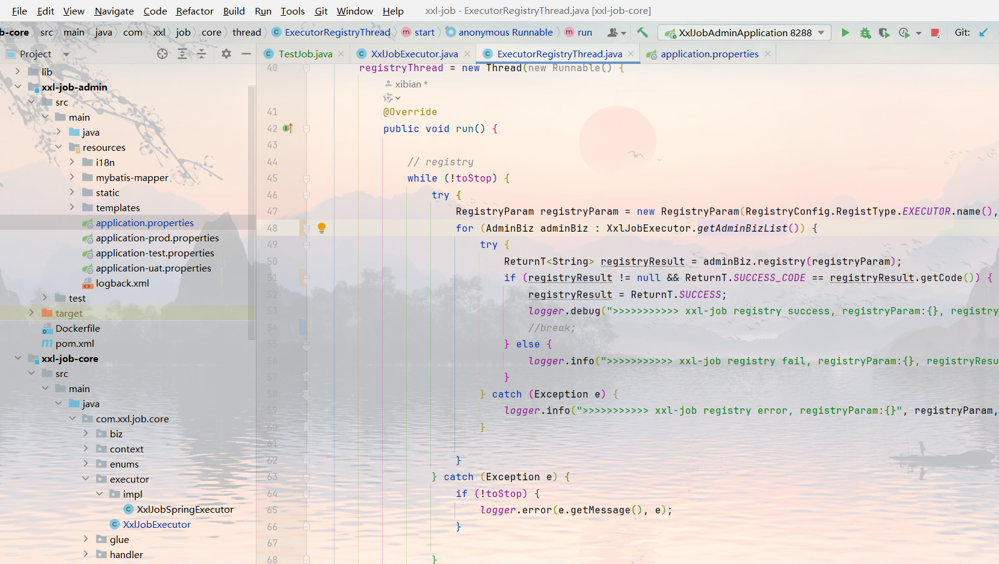

### 针对 XXL-JOB 实现 SaaS 化改造的需求

随着公司业务的发展，为了支持多租户使用，我们计划将现有的 XXL-JOB 系统进行 SaaS 化改造。当前项目中使用的 XXL-JOB 版本为 2.2.0-SNAPSHOT，基于此版本，我们将对整体逻辑进行梳理。

#### 一、核心概念

- **整体框架概览**

  

- **调度中心**：作为独立服务存在，主要负责执行器、任务和调度日志的管理，本身并不承担具体的业务功能。
- **执行器**：指引入了 XXL-JOB 服务的应用实例，每个服务实例对应一个执行器实例，而每个执行器可以拥有多个实例。
- **任务**：指的是由用户编写的需要通过 XXL-JOB 进行调度的业务逻辑代码。

#### 二、执行器深入解析

经过查阅官方文档（见），发现`initJobHandlerRepository(applicationContext)`方法已被注释掉。但在我们公司的项目中似乎仍然启用了这部分代码，这可能是遗留问题。实际上，现在应该直接关注`initJobHandlerMethodRepository`，它会在项目启动时自动扫描带有`@XxlJob`注解的方法，并将其相关信息（如任务名称、初始化及销毁方法等）注册到本地 Map 中，以任务名称作为键值，即调度中心的任务管理中的 JobHandler。（见）

#### 三、向调度中心注册

根据配置文件中的 address 信息，初始化调度中心连接，并将自身服务的执行器名称、IP 地址及端口号发送至调度中心完成注册。

---
