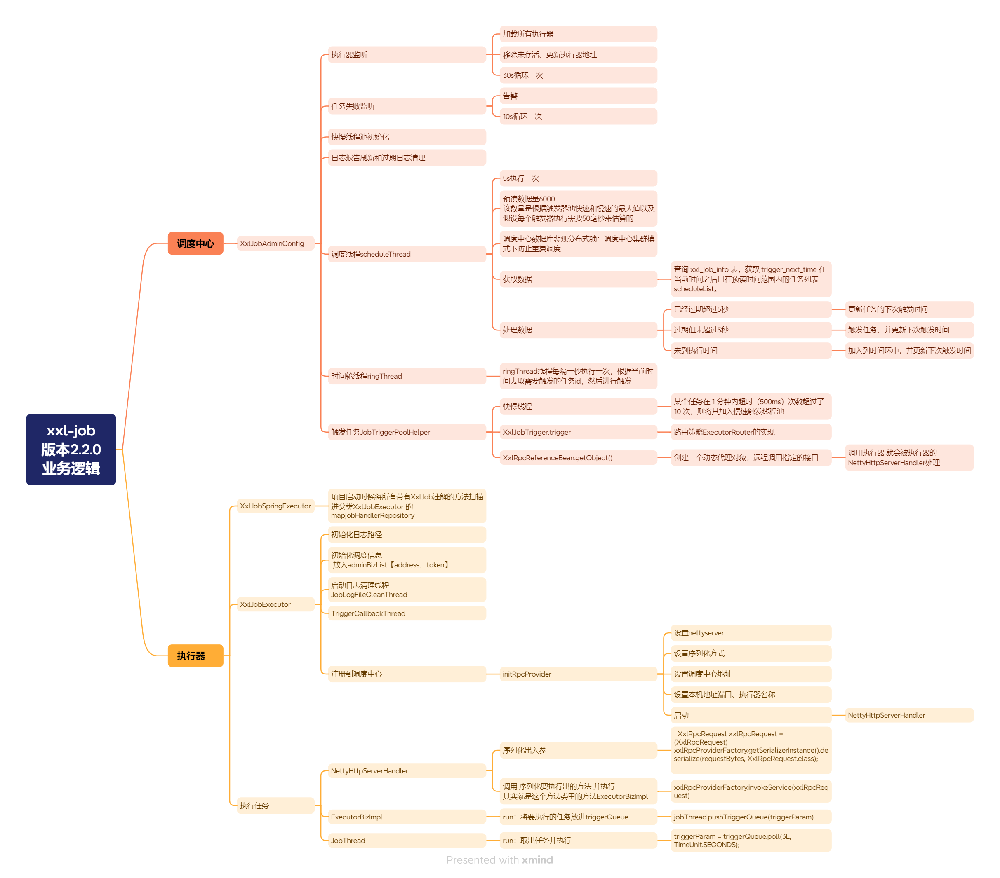

### 调度中心

- **XxlJobAdminConfig**
  - **执行器监听**
    - 加载所有执行器
    - 移除未存活、更新执行器地址
    - 每 30 秒循环一次
  - **任务失败监听**
    - 告警
    - 每 10 秒循环一次
  - **快慢线程池初始化**
  - **日志报告刷新和过期日志清理**
  - **调度线程 scheduleThread**
    - 每 5 秒执行一次
    - 预读数据量 6000（该数量是根据触发器池快速和慢速的最大值以及假设每个触发器执行需要 50 毫秒来估算的）
    - 使用调度中心数据库悲观分布式锁防止在集群模式下重复调度
    - 获取数据：查询`xxl_job_info`表，获取`trigger_next_time`在当前时间之后且在预读时间范围内的任务列表`scheduleList`
    - 处理数据：
      - 已经过期超过 5 秒：更新任务的下次触发时间
      - 过期但未超过 5 秒：触发任务，并更新下次触发时间
      - 未到执行时间：加入到时间环中，并更新下次触发时间
  - **时间轮线程 ringThread**
    - `ringThread`线程每隔一秒执行一次，根据当前时间去取需要触发的任务 ID，然后进行触发
  - **触发任务 JobTriggerPoolHelper**
    - 快慢线程：某个任务在 1 分钟内超时（500ms）次数超过了 10 次，则将其加入慢速触发线程池
    - `XxlJobTrigger.trigger`：路由策略`ExecutorRouter`的实现
    - `XxlRpcReferenceBean.getObject()`：创建一个动态代理对象，远程调用指定的接口。调用执行器就会被 NettyHttpServerHandler 处理

### 执行器

- **XxlJobSpringExecutor**
  - 项目启动时候将所有带有`XxlJob`注解的方法扫描进父类`XxlJobExecutor`的`mapjobHandlerRepository`
- **XxlJobExecutor**
  - 初始化日志路径
  - 初始化调度信息放入`adminBizList`【address、token】
  - 启动日志清理线程`JobLogFileCleanThread`
  - `TriggerCallbackThread`
  - 注册到调度中心
    - `initRpcProvider`
      - 设置 nettyserver
      - 设置序列化方式
      - 设置调度中心地址
      - 设置本机地址端口、执行器名称
      - 启动：NettyHttpServerHandler
- **执行任务**
  - **NettyHttpServerHandler**
    - 序列化出入参：
      ```
      XxlRpcRequest xxlRpcRequest = (XxlRpcRequest) xxlRpcProviderFactory.getSerializerInstance().deserialize(requestBytes, XxlRpcRequest.class);
      ```
    - 调用序列化要执行出的方法并执行，实际上是通过`ExecutorBizImpl`方法里的逻辑执行。
  - **ExecutorBizImpl**
    - run：将要执行的任务放进`triggerQueue`
      ```
      jobThread.pushTriggerQueue(triggerParam)
      ```
  - **JobThread**
    - run：取出任务并执行
      ```
      triggerParam = triggerQueue.poll(3L, TimeUnit.SECONDS);
      ```
