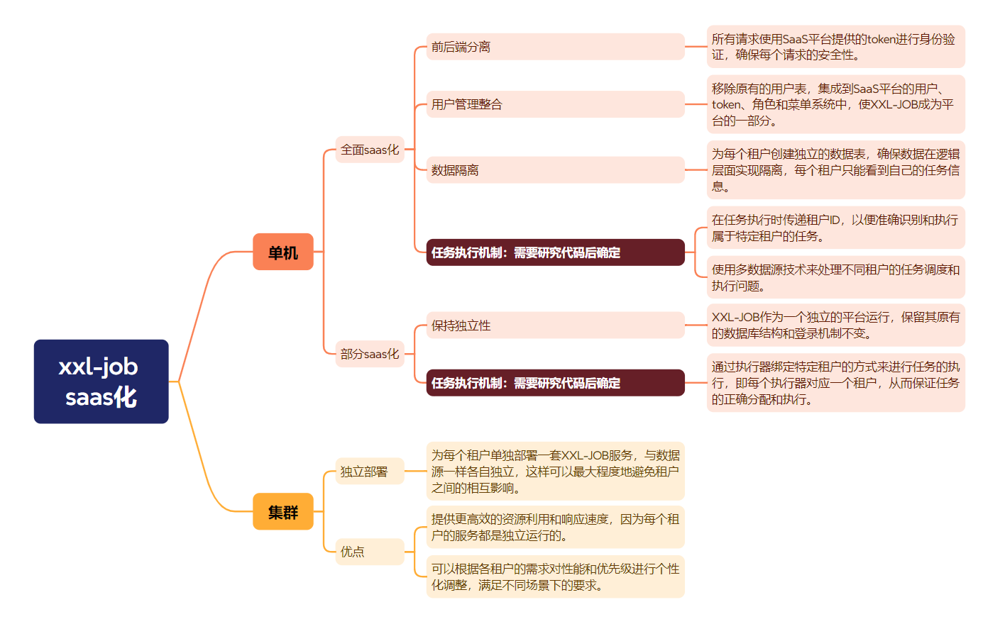

多租户设计参考 https://www.cnblogs.com/cherf/p/16735230.html



### **一、单机场景：全面 SaaS 化**

#### **核心设计**

1. **身份与权限融合**

   - 删除 XXL-JOB 原生用户表，完全复用 SaaS 平台的统一身份体系（用户/角色/权限）。
   - 所有 API 请求通过 SaaS 平台颁发的 JWT Token 鉴权，Token 中需携带`tenant_id`和`user_permissions`。
   - **改造重点**：重写`XxlJobAdminController`的登录拦截器，替换为 SaaS 平台的 Token 验证逻辑。

2. **数据隔离方案**

   - **方案 A（分表隔离）**：
     - 所有业务表（如`xxl_job_group`, `xxl_job_info`）增加`tenant_id`字段，通过 MyBatis 拦截器自动注入`WHERE tenant_id = ?`条件。
     - **缺点**：需修改所有 SQL 语句，租户数据物理未隔离。
   - **方案 B（分 Schema 隔离）**：
     - 每个租户独立数据库 Schema（如`tenant_001`），通过动态数据源切换（如`DynamicDataSource + TenantContext`）。
     - **关键代码**：自定义`DataSourceRouter`，根据当前租户 ID 选择对应 Schema。

3. **任务执行隔离**
   - **执行器路由策略**：
     - 执行器启动时注册携带`tenant_id`（如`AppName=executor_tenantA`）。
     - 调度中心根据任务的`tenant_id`选择对应执行器集群。
   - **任务参数透传**：
     - 在任务触发时，将`tenant_id`注入任务参数（`JobDataMap`），执行器根据`tenant_id`切换数据源或业务上下文。

#### **优化点**

- **动态表名改写**：使用 ShardingSphere 或 MyBatis 插件，根据租户 ID 自动重写表名为`${table_name}_${tenant_id}`，避免手动建表。
- **缓存隔离**：Redis 缓存 Key 增加租户前缀（如`tenantA:job_list`），防止数据串扰。
- **任务日志隔离**：日志存储按`tenant_id`分目录（如`/logs/tenantA/job.log`），便于排查问题。

---

### **二、单机场景：部分 SaaS 化**

#### **核心设计**

1. **独立部署模式**

   - 保持 XXL-JOB 原有数据库和用户体系不变，仅对**执行器**进行租户化改造。
   - 每个执行器启动时绑定固定租户（如通过启动参数`-DtenantId=tenantA`）。

2. **任务调度逻辑**
   - 在 XXL-JOB Admin 中手动为每个任务指定**执行器集群**（即租户集群）。
   - **缺点**：需人工维护任务与租户的绑定关系，易出错。

#### **优化点**

- **自动化绑定**：开发**租户-执行器路由插件**，根据任务的`tenant_id`自动选择对应执行器，无需人工干预。
- **执行器动态注册**：执行器启动时通过 SaaS 平台获取`tenant_id`，并自动注册到 XXL-JOB Admin。

---

### **三、集群场景：一租户一服务**

#### **核心设计**

1. **独立服务部署**

   - 每个租户独占一套 XXL-JOB Admin + 执行器集群，数据库完全隔离。
   - **部署工具**：使用 Helm Chart 或 Kustomize 为每个租户生成独立 K8s 部署模板。

2. **统一入口网关**

   - 通过 API 网关（如 Spring Cloud Gateway）实现租户路由：
     ```yaml
     routes:
       - id: tenantA_route
         uri: lb://xxl-job-tenantA-admin
         predicates:
           - Header=X-Tenant-Id, tenantA
     ```
   - 用户访问`saas-platform.com/job`时，网关根据 Header 中的`X-Tenant-Id`路由到对应租户服务。

3. **资源弹性管理**
   - **小租户**：多个租户共享同一 K8s Node，通过 Namespace 隔离。
   - **大租户**：独享物理机或专属 Node Pool，保障 SLA。

#### **优化点**

- **镜像预热**：预生成带租户配置的 Docker 镜像，加快实例扩容速度。
- **跨租户监控**：使用 Prometheus 联邦集群，集中采集各租户服务的监控指标。

---

### **四、关键问题解决方案**

#### **问题 1：多数据源任务执行**

- **方案 A（动态数据源）**：  
  执行器内集成多数据源，任务触发时根据`tenant_id`切换数据源：
  ```java
  public class TenantJobHandler extends IJobHandler {
      @Override
      public void execute() throws Exception {
          String tenantId = TenantContext.get();
          DataSourceContext.switch(tenantId); // 切换至租户数据源
          // 执行业务逻辑
      }
  }
  ```
- **方案 B（隔离线程池）**：  
  每个租户的任务分配独立线程池，避免上下文切换导致数据源混乱。

#### **问题 2：租户资源配额**

- **配额管理**：在 SaaS 平台增加租户管理模块，限制每个租户的**最大任务数**、**执行器实例数**、**日志存储周期**。
- **熔断机制**：当租户任务超阈值时，自动拒绝新任务创建并触发告警。

---

### **五、推荐架构选型**

| 场景                    | 推荐方案                            | 适用客户类型         |
| ----------------------- | ----------------------------------- | -------------------- |
| 中小型 SaaS（快速落地） | 单机全面 SaaS 化 + 动态 Schema 隔离 | 初创企业、互联网客户 |
| 大型企业/强隔离需求     | 集群模式（一租户一服务）            | 金融、政务、医疗客户 |
| 混合部署需求            | 部分 SaaS 化 + 执行器自动路由       | 已有私有化部署的客户 |

---

### **六、实施路径建议**

1. **Phase 1**：改造 XXL-JOB Admin，集成 SaaS 平台 Token 鉴权，实现基础租户隔离。
2. **Phase 2**：引入动态数据源管理，支持分 Schema/分表数据隔离。
3. **Phase 3**：开发执行器自动路由插件，实现任务与租户的智能绑定。
4. **Phase 4**：构建租户资源配额体系和监控告警模块，完善 SaaS 化能力。

通过以上方案，可平衡数据隔离性与改造成本，灵活适配不同规模客户需求。
